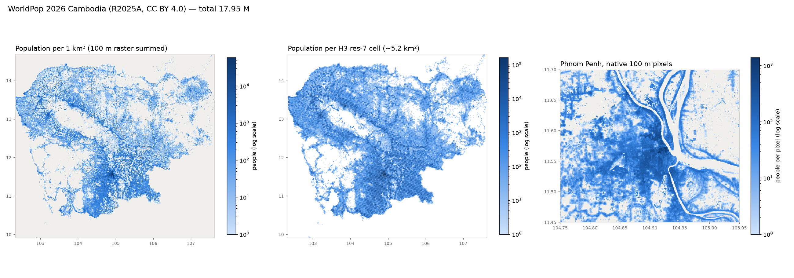

# Cambodia H3 POI Atlas (`kh-h3-atlas`)

A reproducible pipeline that divides Cambodia into [H3](https://h3geo.org) hexagons and attaches
open data to every hexagon: **population** (WorldPop) and **points of interest** (OpenStreetMap):
schools, clinics, banks, pagodas, shops, restaurants and more.

The result is a set of layers you can open in **QGIS**. In the next milestone it becomes a single
**per-hexagon feature table** for mapping and modelling. Each hexagon will know its population,
how many facilities of each type it has, and how many are nearby.



---

## Contents

1. [Project status](#1-project-status)
2. [Data sources](#2-data-sources)
3. [Setup](#3-setup)
4. [Running the pipeline](#4-running-the-pipeline)
5. [Outputs](#5-outputs)
6. [Viewing the results in QGIS](#6-viewing-the-results-in-qgis)
7. [Configuration](#7-configuration)
8. [How each stage works](#8-how-each-stage-works)
9. [Project structure](#9-project-structure)
10. [Development](#10-development)
11. [Known caveats](#11-known-caveats)
12. [Troubleshooting](#12-troubleshooting)
13. [Licenses and attribution](#13-licenses-and-attribution)

---

## 1. Project status

| Milestone | What | Status |
|---|---|---|
| 1 | Scaffold: CLI, config, DuckDB, manifest, tests | ✅ done |
| 2 | Country boundary and H3 grid (res 8) | ✅ done |
| 3 | Population per hexagon (WorldPop) | ✅ done |
| 4 | POIs (OpenStreetMap) and category groups | ✅ done (category groups are a draft, under review) |
| 5 | Per-hex feature table and export (GeoPackage, QGIS styles, project) | ⏳ next |
| 6 | Optional extra POI sources and duplicate removal | planned |
| 7 | Province/district/commune tagging and attribution file | planned |

Current results (reference date **2026-09-23**, resolution 8):

| Layer | Result |
|---|---|
| Boundary | 33 polygons (mainland + 32 islands), 181,669 km² |
| H3 grid, res 8 | 215,239 hexagons (~0.86 km² each over Cambodia) |
| Population | 17,951,035 people in hexagons, vs 17,951,445 in the raster (−0.002%) |
| POIs (OSM) | 29,397 inside Cambodia; 88% fall into one of 9 category groups |

The full design brief is in [`docs/BRIEF.md`](docs/BRIEF.md). Decisions that differ from it are
listed in [`CLAUDE.md`](CLAUDE.md).

---

## 2. Data sources

All sources are **aligned to one date**, `reference_date` in `config/default.yaml`. Each source
uses its latest snapshot **on or before** that date, so no layer has data newer than the others.

| Component | Provider | Where it comes from | Snapshot used | License |
|---|---|---|---|---|
| Country boundary | Overture Maps, `divisions` theme | `s3://overturemaps-us-west-2/release/<release>/theme=divisions/type=division_area/` | `2026-09-23.1` | ODbL |
| Points of interest | OpenStreetMap contributors, extract by Geofabrik | `https://download.geofabrik.de/asia/cambodia-<YYMMDD>.osm.pbf` | `cambodia-260923.osm.pbf` | ODbL |
| Population | WorldPop R2025A (University of Southampton) | `https://data.worldpop.org/GIS/Population/Global_2015_2030/R2025A/<year>/KHM/v1/100m/constrained/` | `khm_pop_2026_CN_100m_R2025A_v1.tif` | CC BY 4.0 |
| Hexagons | Uber H3 (software, not data) | `h3` Python package, DuckDB `h3` extension | — | Apache-2.0 |

Overture **places** (POIs) is also implemented but switched off. We compared it with OSM in QGIS
and chose OSM.

Details, snapshot retention and attribution text: [`docs/SOURCES.md`](docs/SOURCES.md).
To see exactly what will be used for the configured date:

```bash
uv run kh-atlas sources
```

---

## 3. Setup

Tested on **Ubuntu 24.04**. No GPU or database server is needed.

### 3.1 Requirements

| Need | Why |
|---|---|
| `git` and `curl` | clone the repo, install uv |
| [uv](https://docs.astral.sh/uv/) | installs Python 3.11 and all packages; nothing else to install by hand |
| Internet access | downloads about 150 MB of data on the first run |
| ~2 GB free disk | raw downloads plus generated files |
| QGIS (optional) | to view the results (see [section 6](#6-viewing-the-results-in-qgis)) |

GDAL, DuckDB and rasterio come as Python wheels, so **no system GIS libraries are needed**.

### 3.2 Install uv (once per machine)

```bash
curl -LsSf https://astral.sh/uv/install.sh | sh
# then open a new terminal, or:
source ~/.bashrc
uv --version
```

### 3.3 Get the code and install dependencies

```bash
git clone https://github.com/NDarayut/cambodia_h3_poi.git
cd cambodia_h3_poi
uv sync          # downloads Python 3.11 if needed and installs everything from uv.lock
```

### 3.4 Check the installation

```bash
uv run kh-atlas --help     # lists all commands
uv run pytest              # 16 tests; the first run downloads DuckDB's h3/spatial extensions
uv run kh-atlas sources    # checks the data sources are reachable for the reference date
```

### 3.5 Install QGIS (optional, for viewing)

The quickest way is Ubuntu's own package (QGIS 3.34):

```bash
sudo apt update
sudo apt install qgis qgis-plugin-grass
```

For the current version, use the official QGIS repository instead:
<https://qgis.org/resources/installation-guide/#debian--ubuntu>.

---

## 4. Running the pipeline

Every stage is its own command. Each one:
- skips its work if its outputs already exist and its inputs haven't changed
- can be forced to rebuild with `--force`
- records what it did in `data/processed/manifest.json`

Run the stages in this order on the first run:

```bash
uv run kh-atlas boundary      # ~6 min first time (reads Overture from S3), then cached
uv run kh-atlas grid          # ~70 s
uv run kh-atlas population    # downloads the 19 MB WorldPop raster, then ~10 s
uv run kh-atlas poi-osm       # downloads the 41 MB OSM extract, then ~5 s
uv run kh-atlas explore-categories   # prints POI category counts (helps edit the groups)
```

Or run everything in one go:

```bash
uv run kh-atlas run-all
```

`run-all` checks the sources, then runs every enabled stage. For now it stops with a message at
the first stage that isn't built yet (`dedupe`, planned for a later milestone). All stages before
it will have finished.

Useful options:

```bash
uv run kh-atlas grid --force                        # rebuild one stage
uv run kh-atlas --config config/my.yaml run-all     # use a different config file
uv run kh-atlas --verbose population                # debug logging
```

---

## 5. Outputs

Everything is written under `data/`. Only the QGIS-ready GeoPackages in `data/interim/qgis/`
are stored in git, so `qgis/khm_poi_h3.qgz` opens right after cloning. Everything else is regenerated by the pipeline.

```
data/
├── raw/                                     # untouched downloads (checksums in manifest)
│   ├── overture/2026-09-23.1/
│   │   ├── division_area.parquet            # all Cambodian admin areas (399 rows)
│   │   └── place.parquet                    # Overture places in the bbox (if enabled)
│   ├── osm/260923/cambodia-260923.osm.pbf
│   └── worldpop/R2025A_2026/khm_pop_2026_CN_100m_R2025A_v1.tif
├── interim/                                 # cleaned, H3-indexed tables (GeoParquet/Parquet)
│   ├── boundary.parquet                     # country polygons: part_id, area_km2, geometry
│   ├── grid_res8.parquet                    # h3, h3_str, res, lat, lng
│   ├── worldpop_pixels.parquet              # populated pixel centres: lat, lng, pop
│   ├── population_res8.parquet              # h3, h3_str, population, n_pixels
│   ├── poi_osm.parquet                      # one row per POI (schema below)
│   ├── categories_osm.csv                   # category counts from explore-categories
│   └── qgis/                                # GeoPackage copies for QGIS
│       ├── boundary.gpkg
│       ├── grid_res8.gpkg                   # all 215,239 hexagons
│       ├── population_res8.gpkg             # populated hexagons only (125,410)
│       └── poi_osm.gpkg                     # POI points
└── processed/
    └── manifest.json                        # sources, checksums, row counts, versions
```

**POI table columns** (`poi_osm.parquet`):

| Column | Meaning |
|---|---|
| `source`, `source_id` | `osm`, and the OSM id (`node/123` or `way/456`) |
| `name`, `name_en` | name as tagged, plus English name if present |
| `category` | main tag, e.g. `amenity=school`, `shop=clothes` |
| `category_hierarchy` | `[key, key=value]`, e.g. `[amenity, amenity=school]` |
| `lat`, `lng` | location (for ways, the mean of their nodes) |
| `h3_res8`, `h3_res11` | H3 cell at res 8 (joins to the grid) and res 11 (for duplicate matching) |
| `attrs` | all OSM tags as JSON |

---

## 6. Viewing the results in QGIS

### 6.1 Open the ready-made project

Two QGIS projects are in `qgis/`. Double-click one, or use QGIS → Project → Open:

- `qgis/khm_poi_h3.qgz`: boundary, grid, population hexagons, POIs (OSM and Overture) and an
  OpenStreetMap basemap. Its layers are in the repo, so it **opens right after cloning**, with
  no need to run the pipeline.
- `qgis/khm_pop.qgz`: the WorldPop 100 m population raster. The `.tif` is not in the repo;
  run `uv run kh-atlas population`, then copy it to the top folder:
  ```bash
  cp data/raw/worldpop/R2025A_2026/khm_pop_2026_CN_100m_R2025A_v1.tif .
  ```

If you rerun the pipeline, it overwrites these layers in `data/interim/qgis/`, and the projects
show the new data.

### 6.2 Or add the layers yourself

Drag the files from `data/interim/qgis/` into QGIS. Recommended order in the Layers panel (top
layers draw over lower ones):

```
├── poi_osm            points
├── boundary           thick outline, no fill
├── grid_res8          thin outline, no fill
├── population_res8    coloured by population
└── OpenStreetMap      basemap (Browser panel → XYZ Tiles → OpenStreetMap)
```

### 6.3 Styling tips

| Layer | How |
|---|---|
| **population_res8** | Symbology → **Graduated** → Value `population` → Mode **Quantile (Equal Count)**, 7–9 classes → **Classify**. To remove outlines: click the **Symbol** preview → **Simple Fill** → Stroke style **No Pen** (click **Classify** again if the classes don't update). |
| **grid_res8** | Symbology → **Simple Fill** → Fill color ▾ → **Transparent fill**; stroke width `0.1`. Rendering tab → **Scale Dependent Visibility**, minimum `1:100000`, so it only draws when zoomed in. |
| **Raster (.tif)** | Symbology → **Singleband pseudocolor**, min `1`, max `200`. |
| **Opacity** | Vector layers: Symbology → Layer Rendering → Opacity. Raster layers: the **Transparency** tab → Global Opacity. |
| **Live styling** | Press **F7** for the Layer Styling panel; changes apply immediately. |

Population is very skewed: half of the populated hexagons have fewer than 16 people, while the
densest have 60,000. Always use quantile or log-style classes.

### 6.4 Exploring POIs

Right-click `poi_osm` → **Filter…** to show one type of place:

```
"category" = 'amenity=place_of_worship'                 -- pagodas and others
"category" IN ('amenity=hospital','amenity=clinic')     -- health
"category" IN ('amenity=bank','amenity=atm')            -- finance
```

Use the **Identify Features** tool (the "i" cursor) to click a hexagon or point and see its
values, and **Open Attribute Table** to sort and browse.

---

## 7. Configuration

### 7.1 `config/default.yaml`

| Setting | Default | Meaning |
|---|---|---|
| `reference_date` | `2026-09-23` | Point in time for all sources. Change this one value to rebuild for another date. |
| `max_source_lag_days` | `45` | Warn if a snapshot is older than this before the reference date. |
| `bbox` | lon 102.3–107.7, lat 9.9–14.7 | Coarse prefilter only (it includes parts of TH/LA/VN); results are always clipped to Cambodia. |
| `sources.overture.release` | `auto` | `auto`, or pin a release such as `2026-09-23.1`. |
| `sources.worldpop.year` | `auto` | `auto` = year of `reference_date`. |
| `sources.worldpop.constrained` | `true` | `true` = people placed only where buildings were detected. |
| `sources.osm.snapshot` | `auto` | `auto`, or pin a Geofabrik date such as `260901`. |
| `h3.resolutions` | `[8]` | Hexagon sizes to build. Res 7 ≈ 6 km², res 8 ≈ 0.86 km², res 9 ≈ 0.12 km² (over Cambodia). |
| `h3.poi_index_res` | `11` | Fine H3 level stored on POIs, for duplicate matching. |
| `grid.containment` | `overlap` | `overlap` = every hexagon touching Cambodia (keeps small islands); `center` = only hexagons whose centre is inside. |
| `grid.buffer_m` | `0` | Grow the boundary by this many metres before building the grid. |
| `poi.use` | `osm: true`, others `false` | Which POI sources to use. |
| `poi.min_confidence` | `0.6` | Overture places only. |
| `features.*` | | Used from Milestone 5 (neighbour rings, data-gap threshold). |

Resolution 9 takes about 7+ minutes to build and produces about 1.5 million hexagons. Start with 8.

### 7.2 `config/poi_categories.yaml`: POI groups

Maps OSM tags to groups. Each group becomes a count column (`n_health`, `n_education`, ...).

```yaml
groups:
  health:
    osm: [amenity=hospital, amenity=clinic, amenity=pharmacy, healthcare=*]
  ...
  retail:            # keep wildcard groups last
    osm: [amenity=marketplace, shop=*]
```

- Patterns are `key=value`, or `key=*` for any value.
- Groups are checked **in order**, and a POI joins only the **first** group it matches.
- POIs matching no group still count toward the total `n_poi`.
- Run `uv run kh-atlas explore-categories` to see which categories exist and how common they are.

Current groups: health, education, finance, religious, government, transport, food, lodging,
retail.

---

## 8. How each stage works

| Stage | Input → output | Method |
|---|---|---|
| `sources` | online indexes → manifest | Lists Overture releases (S3) and Geofabrik snapshots, then picks the latest on or before `reference_date`. Retries, and falls back to snapshots already in `data/raw/` if an index is down. |
| `boundary` | Overture divisions → `boundary.parquet` | Selects `country='KH'`, `subtype='country'`, `class='land'` and splits the MultiPolygon into its 33 parts. Checks the area is 170–190k km². |
| `grid` | boundary → `grid_res8.parquet` | H3 polyfill of each part (`overlap` mode), merged and deduplicated. Checks: no duplicates, correct resolution, total hexagon area 1.0–1.2× land area, every island has at least one hexagon. |
| `population` | WorldPop GeoTIFF → `population_res8.parquet` | Every populated 100 m pixel becomes a point at its centre, and points are summed per hexagon (about 100 pixels per res-8 hexagon). Joined to the grid so empty hexagons get 0. Checks the total is within ±1% of the raster. |
| `poi-osm` | OSM `.pbf` → `poi_osm.parquet` | Nodes and ways with a POI tag (amenity, shop, healthcare, office, tourism, …). Street furniture and airport internals are excluded. Kept only if inside Cambodia (fast grid match, then an exact point-in-country test). |
| `poi-overture` | Overture places → `poi_overture.parquet` | Same schema, `confidence ≥ 0.6`, open places only. Disabled by default. |
| `explore-categories` | POI tables → CSV and printout | Category counts per source. |

Most processing is SQL run by DuckDB (`src/kh_h3_atlas/sql/`). Python is used only for reading
the GeoTIFF (rasterio).

---

## 9. Project structure

```
├── config/
│   ├── default.yaml             # pipeline settings
│   └── poi_categories.yaml      # POI category groups
├── docs/
│   ├── BRIEF.md                 # original project brief
│   └── SOURCES.md               # data provenance, snapshots, attribution
├── notebooks/                   # exploration only (not used by the pipeline)
├── qgis/                        # QGIS project files (layers: data/interim/qgis/, in git)
├── src/kh_h3_atlas/
│   ├── cli.py                   # `kh-atlas` commands
│   ├── config.py                # config models (Pydantic)
│   ├── sources.py               # date-aligned source resolution
│   ├── db.py                    # DuckDB connection (spatial, httpfs, h3), GeoPackage writer
│   ├── download.py              # checksummed downloads
│   ├── manifest.py              # run manifest, cache freshness
│   ├── categories.py            # POI groups → SQL
│   ├── stages/                  # one module per stage
│   └── sql/                     # SQL used by the stages
├── tests/                       # unit tests (no data downloads needed)
├── pyproject.toml, uv.lock      # dependencies (managed by uv)
└── CLAUDE.md                    # working notes and decisions
```

---

## 10. Development

```bash
uv run pytest                        # run tests
uv run ruff check .                  # lint
uv run ruff format .                 # format
```

Conventions:
- Each stage exposes `run(cfg, force) -> list[Path]`.
- A stage skips its work when cached, writes under `data/`, and calls `manifest.record_stage(...)`.
- Checks that must hold (totals, no duplicates, nothing outside the grid) raise an error.
  Softer sanity checks only log.
- Prefer SQL files in `src/kh_h3_atlas/sql/` over pandas.

---

## 11. Known caveats

- **POI coverage is uneven.** OSM is dense in Phnom Penh and Siem Reap and sparse in rural areas.
  Zero POIs in a hexagon often means *not mapped*, not *nothing there*.
- **Population is a model estimate** (WorldPop 2026 projection), not a census. The *constrained*
  version only places people where buildings were detected, so 42% of hexagons have population 0.
- **H3 levels don't nest perfectly.** Population assigned directly at res 7 differs slightly from
  res-8 hexagons summed to their parents. National totals match either way.
- **H3 cells over Cambodia are ~16% larger** than H3's global average, so count estimates based on
  the average are too high.
- **Coastlines are simplified** in Overture's boundary; fine at res 8.
- **Snapshots expire:** Overture keeps releases for about 60 days, and Geofabrik keeps daily
  extracts for about a week (monthly and yearly ones for longer). Downloads are cached in `data/raw/`,
  but a fresh clone needs a `reference_date` whose snapshots are still online (see below).

---

## 12. Troubleshooting

| Problem | Fix |
|---|---|
| `No Overture release on/before <date>` | That release has been removed from S3. Set `reference_date` to a recent date (check with `uv run kh-atlas sources`). |
| `... index unreachable ...; using cached snapshots` | A source website is down. The pipeline falls back to files already in `data/raw/`; this is only a warning. |
| Timeout from `download.geofabrik.de` on a fresh machine | Geofabrik is temporarily down and nothing is cached yet. Try again later. |
| `grid_res8 missing; run kh-atlas grid first` | Run the stages in the order in [section 4](#4-running-the-pipeline). |
| `boundary` is slow | The first run reads Overture from S3 (~6 min). Later runs use the cached copy. |
| QGIS layers show a red "!" | A layer file is missing. Check `data/interim/qgis/` exists (it is in the repo), or rerun the pipeline. |
| Tests fail loading `h3` | The first test run needs internet to install DuckDB's `h3` extension. |

---

## 13. Licenses and attribution

When you publish maps or data from this project, credit:

- **Population:** WorldPop (www.worldpop.org), Global 2015–2030 R2025A, CC BY 4.0.
- **Points of interest:** © OpenStreetMap contributors, ODbL (https://www.openstreetmap.org/copyright).
- **Boundary:** Overture Maps Foundation (https://overturemaps.org), ODbL.
- **Basemap in QGIS:** © OpenStreetMap contributors.

Data derived from OSM and Overture divisions (ODbL) must remain under an open, share-alike license.
